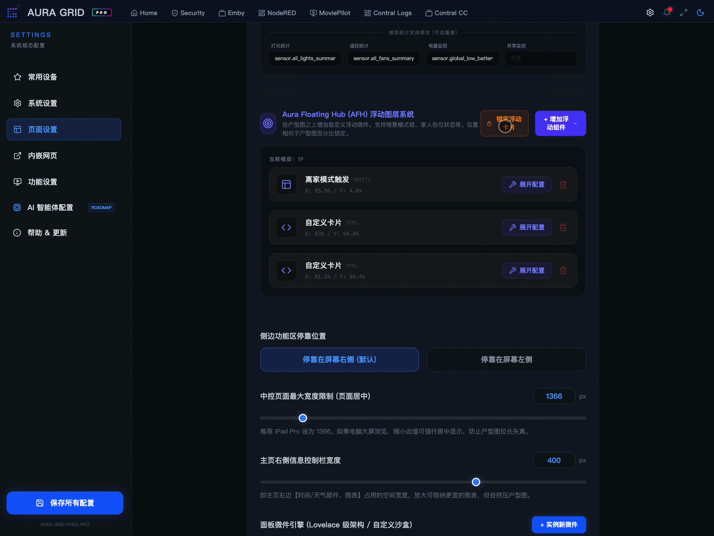
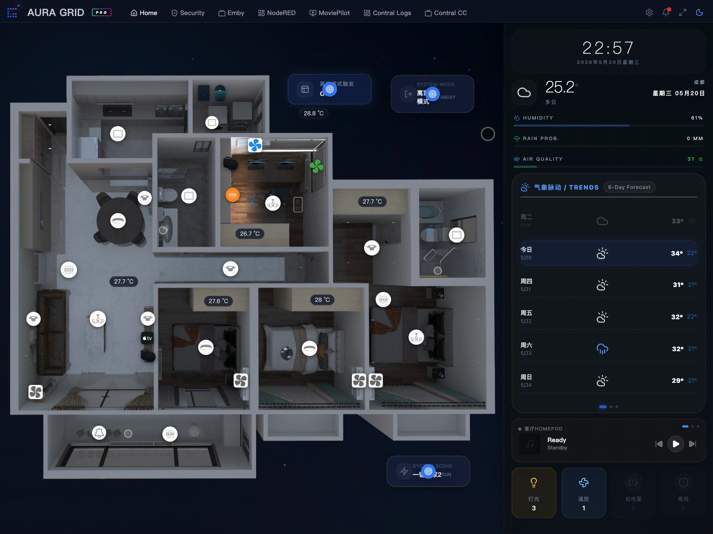

# Aura Floating Hub (AFH) Floating Widget Configuration and Development Guide

This guide serves as a technical manual for developers and AI assistants to author custom HTML widgets for the "Aura Floating Hub (AFH) Floating Layer System" in Aura Grid Pro. Adhering to these specifications ensures that custom floating components coordinate with drag-and-drop mechanics, fit pre-configured visual themes, and communicate efficiently with Home Assistant.

---

## 1. Floating Layer Runtime Characteristics

AFH is an absolute positioning overlay situated above the primary dashboard canvas. Compared to sidebar widgets, floating widgets have distinct layout, sizing, and styling parameters:

*   **Center Anchor and Percentage Positioning**: Floating widgets are positioned relative to the parent overlay using percentages: `left: xPct%` and `top: yPct%`. The coordinate anchor is exactly at the geometric center of the widget (CSS property `transform: translate(-50%, -50%)`).
*   **Manual Dragging and State Persistence**: When the dashboard is unlocked, an edit overlay covers each widget. In this state, dragging the handle recalculates coordinates and updates `uiStore.saveLayout()`. When the dashboard is locked, the drag overlay disappears, and all interactive triggers (clicks, touches) inside the custom code are fully enabled.
*   **Theme Wrapper**: Floating widgets can be configured to use built-in system themes (e.g. `afh-theme-glass` or `afh-theme-neon-blue`). The wrapper handles borders, shadows, and backdrop-blur styling. Custom HTML widgets render inside a padded-free wrapper container (`padding: 0`), allowing seamless integrations.

---

## 2. Context Interfaces and Variables

Custom floating widgets utilize the same dynamic Single File Component (SFC) engine as the sidebar widgets, exposing the following context variables:

### 2.1 `haStore` (Home Assistant Pinia Store)
This store maintains the real-time state of all entities.
*   **`haStore.entities`**: Primary state tree of type `Record<string, HaEntity>`.
    *   *State retrieval*: `haStore.entities['light.living_room']?.state` (e.g. `'on'`, `'off'`, `'unavailable'`).
    *   *Attribute lookup*: `haStore.entities['sensor.temperature']?.attributes.friendly_name` or other custom attributes such as temperature `current_temperature` or brightness `brightness`.
*   **`haStore.connected`** (Boolean): WebSocket bridge connection state.
*   **`haStore.loading`** (Boolean): Indicates if the initial entity data is still loading.
*   **`haStore.friendlyNamesMap`** (Computed Map): Fast-lookup dictionary mapping friendly Chinese names to their respective entity objects.

### 2.2 `toggleEntity(entityId)`
A shortcut helper function that toggles the state of switchable domains (switches, lights, input_booleans, etc.) without requiring manual domain parsing.
*   *Example*: `toggleEntity('light.living_room_light')`

### 2.3 `haStore.callService(...)`
For complex service operations (such as setting climate temperatures, adjusting brightness, or controlling media players), you can issue low-level service calls directly:
*   *Parameters*: `haStore.callService(domain, service, entity_id, service_data)`
    *   `domain` (String): e.g., `'light'`, `'climate'`, `'media_player'`
    *   `service` (String): e.g., `'turn_on'`, `'set_temperature'`, `'volume_up'`
    *   `entity_id` (String): Entity ID
    *   `service_data` (Object): Optional service data payload, e.g., `{ brightness: 153 }`
*   *Example*:
    ```javascript
    // Turns on a light and sets its brightness to 60%
    haStore.callService('light', 'turn_on', 'light.living_room', { brightness: 153 });
    ```

---

## 3. Code Format Specification

On the dashboard canvas, when page lock is disabled, you can visually adjust the absolute positioning coordinates of the floating widgets using coordinate grids and drag-and-drop handles. The layout editor interface is shown below:


> **Figure 3.1**: Aura Floating Hub visual coordinate grid overlay and interactive drag interface.

```html
<template>
  <div class="afh-custom-widget">
    <!-- HTML Template: Set container width/height to 100% to fill the theme wrapper -->
    <div class="content flex items-center gap-2">
      <span class="status-dot" :class="haStore.connected ? 'is-online' : 'is-offline'"></span>
      <span class="val">{{ haStore.entities['sensor.outdoor_temp']?.state }}°C</span>
    </div>
  </div>
</template>

<script>
// Script Block: Must follow the export default { setup() { ... } } structure.
// NOTE: Imports from Vue must use CommonJS require('vue') due to the runtime context sandboxing.
const { ref, computed, onMounted } = require('vue');

export default {
  setup() {
    onMounted(() => {
      console.log('AFH custom widget ready.');
    });

    return {};
  }
}
</script>

<style>
/* Style Block: Automatically isolated when mounted, and removed when unmounted. */
.afh-custom-widget {
  width: 100%;
  height: 100%;
  padding: 12px;
  box-sizing: border-box;
}
.status-dot {
  display: inline-block;
  width: 8px;
  height: 8px;
  border-radius: 50%;
}
.is-online { background: #22d3ee; }
.is-offline { background: #f43f5e; }
</style>
```

> [!IMPORTANT]
> **Guidelines and Constraints:**
> 1. **No ES Module Imports**: Do not use `import { ref } from 'vue'` inside `<script>`. Use CommonJS `const { ref } = require('vue')` instead.
> 2. **Optional Chaining (`?.`) Requirement**: When accessing entity states, always use optional chaining (e.g. `haStore.entities['xxx']?.state`). During WebSocket reconnections or initial load, entities may temporarily be undefined. Optional chaining prevents rendering errors.
> 3. **Adaptive Dimension Filling**: Because the physical dimensions (`width` and `height`) of the floating widget are directly controlled in the admin panel, always set your root template wrapper to `width: 100%; height: 100%` to align with the visual box.

---

## 4. AI Prompt Blueprint

When asking external AI models (e.g., Claude or GPT) to write custom code for this floating widget, use the following prompt to guarantee syntax compatibility and compliance:

````markdown
Act as a Vue 3 and Home Assistant development expert. Write a single-file component code block containing <template>, <script>, and <style> tags to build a custom sidebar floating widget for Aura Floating Hub (AFH).

### Context and API Specifications
1. The global `haStore` Pinia store and the helper function `toggleEntity(entityId)` are automatically available in the template and script contexts.
2. The entity states are located in `haStore.entities['entity_id']` with the following structure:
   { entity_id: string, state: string, attributes: { friendly_name: string, [key: string]: any } }
3. To import Vue APIs (such as ref, computed, watch, onMounted), you must use CommonJS:
   `const { ref, computed, onMounted } = require('vue');`
   Do not use ES Module static `import` statements.
4. Use `haStore.callService(domain, service, entity_id, service_data)` for advanced service calls.
5. Always use optional chaining when accessing entity states, e.g., `haStore.entities['light.bedroom']?.state`.

### Styling Guidelines
- The outermost wrapper div must be set to `w-full h-full` to fit the configured float box size.
- Since the parent wrapper provides borders, shadows, and blurs, do not repeat heavy card background styling in your custom CSS. Focus on typography, layout alignment, and compact spacing.
- Use modern sans-serif fonts with precise spacing.

### Requirements
Based on the following functional requirements, output the complete component code block only. Do not include any additional commentary or text.
[Requirements]: [Describe the requested custom floating widget functionality here, e.g., A weather bubble displaying outdoor temperature and humidity with compact typography.]
````

---

## 5. Reference Templates

Below is the live rendering effect of our custom floating widgets integrated onto the 3D floor plan layout:


> **Figure 5.1**: Floating Weather Bubble and Floating Light Monitor Panel templates running live over the 3D dashboard canvas.

### Template A: Floating Weather Bubble
*   **Recommended Dimensions**: 120px x 48px
*   **Theme Wrapper**: Select `afh-theme-glass` or `afh-theme-neon-blue`
*   **Description**: A compact status bubble displaying temperature and humidity in a highly condensed layout.

```html
<template>
  <div class="weather-bubble flex items-center justify-between w-full h-full px-3 py-1.5 font-sans select-none">
    <!-- Temp Box -->
    <div class="flex flex-col">
      <span class="label">TEMP</span>
      <span class="value">{{ haStore.entities['sensor.outdoor_temperature']?.state || '22.0' }}°C</span>
    </div>
    
    <!-- Divider -->
    <div class="h-6 w-[1px] bg-white/10 mx-1"></div>

    <!-- Humidity Box -->
    <div class="flex flex-col text-right">
      <span class="label">HUMI</span>
      <span class="value">{{ haStore.entities['sensor.outdoor_humidity']?.state || '54' }}%</span>
    </div>
  </div>
</template>

<style>
.weather-bubble {
  height: 100%;
  width: 100%;
}
.weather-bubble .label {
  font-size: 8px;
  font-weight: 800;
  color: rgba(255, 255, 255, 0.35);
  letter-spacing: 0.1em;
  line-height: 1;
  margin-bottom: 2px;
}
.weather-bubble .value {
  font-size: 13px;
  font-weight: 700;
  color: #ffffff;
  line-height: 1;
}
</style>
```

### Template B: Floating Light Monitor Panel
*   **Recommended Dimensions**: 180px x 64px
*   **Theme Wrapper**: Select `afh-theme-cyber-red` (for bright glowing alert) or `afh-theme-glass`
*   **Description**: Dynamically calculates the sum of all turned-on lights in the house, displays the active count, and provides a quick shutdown button to turn all lights off.

```html
<template>
  <div class="light-deck flex items-center justify-between w-full h-full px-3.5 font-sans select-none">
    <div class="flex flex-col">
      <span class="title">LIGHT MONITOR</span>
      <div class="flex items-baseline gap-1 mt-0.5">
        <span class="count" :class="activeLightsCount > 0 ? 'text-amber-400' : 'text-gray-400'">{{ activeLightsCount }}</span>
        <span class="unit">Active</span>
      </div>
    </div>

    <!-- Quick Action Button -->
    <button 
      v-if="activeLightsCount > 0"
      @click="turnOffAllLights"
      class="shutdown-btn flex items-center justify-center rounded-lg border border-red-500/30 bg-red-500/10 px-2.5 py-1.5 transition-all duration-300 hover:bg-red-500/20 hover:scale-105 active:scale-95"
    >
      <span class="btn-text">ALL OFF</span>
    </button>
  </div>
</template>

<script>
const { computed } = require('vue');

export default {
  setup() {
    // Dynamic summation of all active lights
    const activeLightsCount = computed(() => {
      let count = 0;
      const entities = haStore.entities;
      for (const id in entities) {
        if (id.startsWith('light.') && entities[id]?.state === 'on') {
          count++;
        }
      }
      return count;
    });

    // Shut down all active lights
    const turnOffAllLights = () => {
      const entities = haStore.entities;
      for (const id in entities) {
        if (id.startsWith('light.') && entities[id]?.state === 'on') {
          haStore.callService('light', 'turn_off', id).catch(console.error);
        }
      }
    };

    return {
      activeLightsCount,
      turnOffAllLights
    };
  }
}
</script>

<style>
.light-deck {
  height: 100%;
  width: 100%;
}
.light-deck .title {
  font-size: 8px;
  font-weight: 800;
  color: rgba(255, 255, 255, 0.4);
  letter-spacing: 0.08em;
  line-height: 1;
}
.light-deck .count {
  font-size: 20px;
  font-weight: 900;
  line-height: 1;
  transition: color 0.3s;
}
.light-deck .unit {
  font-size: 9px;
  color: rgba(255, 255, 255, 0.4);
  font-weight: 600;
}
.light-deck .shutdown-btn {
  cursor: pointer;
  outline: none;
}
.light-deck .btn-text {
  font-size: 10px;
  font-weight: 700;
  color: #f43f5e;
}
</style>
```
