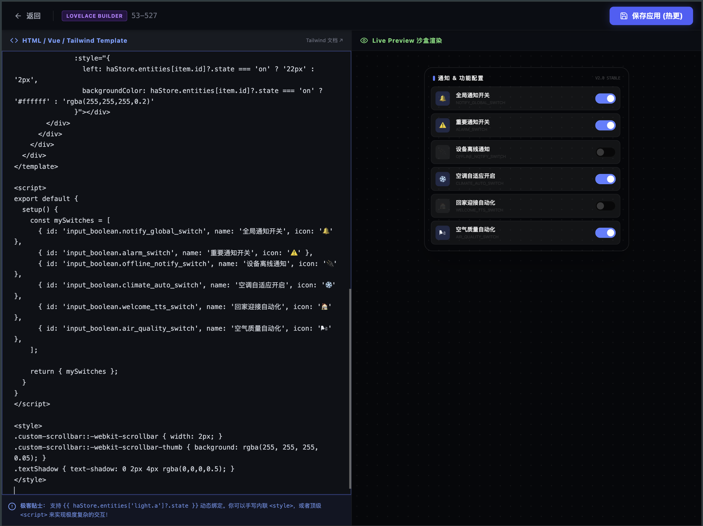

# Aura Grid Pro Custom Widget Development and Configuration Guide

This guide serves as a technical manual for developers and AI assistants (e.g., Claude, GPT) to author custom rendering code for the "Hybrid Swiper Widget" in the Aura Grid Pro sidebar. Adhering to these interface and formatting specifications ensures that custom widgets run stably inside the sandbox container and interact with Home Assistant in real time.

---

## 1. Runtime Architecture

Aura Grid Pro features an integrated, lightweight dynamic Single File Component (SFC) parsing and compilation engine. When custom HTML, CSS, and JavaScript code is entered in the administration panel, the system dynamically compiles and isolates the component at runtime:

*   **Style Scope Isolation**: CSS rules inside the `<style>` tag are dynamically injected into the document `<head>` when the component is mounted, and are automatically removed when the component is unmounted (such as when switching pages or closing the sidebar). This prevents custom styles from polluting the global dashboard design.
*   **Exception Handling and Fault Tolerance**: The component captures rendering and execution errors using `onErrorCaptured`. Any syntax or runtime errors inside the widget are caught and displayed locally within the widget container. This ensures that a failing custom widget does not cause the entire dashboard to crash or freeze.
*   **Hot Reloading**: The compiler hot-reloads the component immediately upon saving the code, reflecting changes without requiring a full browser refresh.

---

## 2. Interfaces and Context Variables

Custom widgets are rendered with pre-injected context variables that communicate directly with the Home Assistant backend. Both the HTML template and the script block can access these APIs:

### 2.1 `haStore` (Home Assistant Pinia Store)
This reactive store maintains the real-time state of all entities bridged to the dashboard.
*   **`haStore.entities`**: The primary state tree, structured as `Record<string, HaEntity>`.
    *   *Get state*: `haStore.entities['light.living_room']?.state` (typically returns `'on'`, `'off'`, `'unavailable'`, etc.).
    *   *Get attributes*: `haStore.entities['sensor.temperature']?.attributes.friendly_name` or other custom attributes such as temperature `current_temperature` or brightness `brightness`.
*   **`haStore.connected`** (Boolean): Connection status of the HA WebSocket bridge.
*   **`haStore.loading`** (Boolean): Indicates whether the initial states are still loading.
*   **`haStore.friendlyNamesMap`** (Computed Map): A fast-lookup dictionary mapping friendly Chinese names to their respective entity objects.

### 2.2 `toggleEntity(entityId)`
A helper function that toggles the on/off state of switchable domains (switches, lights, input_booleans, etc.) without requiring domain parsing or low-level API calls.
*   *Example*: `toggleEntity('light.living_room_light')`

### 2.3 `haStore.callService(...)`
For complex service operations (such as setting climate temperatures, adjusting brightness levels, or controlling media players), you can issue low-level service calls directly:
*   *Parameters*: `haStore.callService(domain, service, entity_id, service_data)`
    *   `domain` (String): e.g., `'light'`, `'climate'`, `'media_player'`
    *   `service` (String): e.g., `'turn_on'`, `'set_temperature'`, `'volume_up'`
    *   `entity_id` (String): Entity ID
    *   `service_data` (Object): Optional service data payload, e.g., `{ brightness: 153 }`
*   *Example*:
    ```javascript
    // Turns on a light and sets its brightness to 60% (153 out of 255)
    haStore.callService('light', 'turn_on', 'light.living_room', { brightness: 153 });
    ```

---

## 3. Code Format Specification (SFC Standard)

Input your SFC source code directly in the Sidebar Custom HTML Swiper configuration box under the System Settings. The configuration panel is shown below:


> **Figure 3.1**: Sidebar SFC dynamic code editor input field.

Custom widgets must follow the standard Mini-SFC Single File Component layout:

```html
<template>
  <div class="custom-widget-container">
    <!-- HTML Template: Supports Vue 3 directives such as v-if, v-for, and @click -->
    <p>Living Room Temperature: {{ haStore.entities['sensor.livingroom_temp']?.state }} °C</p>
    <button @click="toggleEntity('light.living_room')">Toggle Main Light</button>
  </div>
</template>

<script>
// Script Block: Must follow the export default { setup() { ... } } structure.
// NOTE: Imports from Vue must use CommonJS require('vue') due to the runtime context sandboxing.
const { ref, computed, onMounted } = require('vue');

export default {
  setup() {
    const isReady = ref(true);
    
    onMounted(() => {
      console.log('Custom widget mounted.');
    });

    // Exposed values must be returned to be available in the template.
    return {
      isReady
    };
  }
}
</script>

<style>
/* Style Block: Automatically injected when mounted, and removed when unmounted. */
.custom-widget-container {
  padding: 16px;
  background: rgba(20, 26, 35, 0.6);
  border-radius: 24px;
  backdrop-filter: blur(12px);
}
</style>
```

> [!IMPORTANT]
> **Limitations and Rules:**
> 1. **No ES Module Imports**: Do not use `import { ref } from 'vue'` inside the `<script>` tag. The dynamic runtime context does not support native static imports. You must use `const { ref } = require('vue')`.
> 2. **Optional Chaining (`?.`) Requirement**: When accessing entity states, always use optional chaining (e.g. `haStore.entities['xxx']?.state`). During WebSocket reconnections or initial load, entities may temporarily be undefined. Optional chaining prevents rendering errors.
> 3. **Template-Only Mode**: If a widget only requires simple data rendering or toggling, you can omit the `<script>` block entirely and write plain HTML referencing `haStore` and `toggleEntity`.

---

## 4. Visual and Layout Design Guidelines

To maintain visual cohesion with the native glassmorphism and minimal sci-fi design language of Aura Grid Pro, consider the following layout rules:

*   **Background and Glassmorphism**: Use dark backgrounds like `#141a23` or a frosted look with `rgba(20, 26, 35, 0.65)` accompanied by `backdrop-filter: blur(12px)`.
*   **Borders and Shadows**: Use subtle borders like `border border-white/10`. For active states, apply a soft glow using `box-shadow: 0 0 15px rgba(59, 130, 246, 0.15)`.
*   **Typography**: Titles benefit from gradients (such as `bg-gradient-to-r from-blue-400 to-indigo-400 bg-clip-text text-transparent`). Label texts should use uppercase letters with spacious tracking for a high-tech feel (`tracking-widest text-[9px] uppercase text-gray-500`).
*   **Animation Overhead**: Avoid CPU-intensive animations (such as continuous high-radius blurs or continuous rotations). Opt for smooth hover transitions instead (`transition-all duration-300 ease-out`).

---

## 5. AI Prompt Blueprint

When asking external AI models (e.g., Claude or GPT) to write custom code for this widget, use the following prompt to guarantee syntax compatibility and compliance:

````markdown
Act as a Vue 3 and Home Assistant development expert. Write a single-file component code block containing <template>, <script>, and <style> tags to build a custom sidebar widget for Aura Grid Pro.

### Context and API Specifications
1. The global `haStore` Pinia store and the helper function `toggleEntity(entityId)` are automatically available in the template and script contexts.
2. The entity states are located in `haStore.entities['entity_id']` with the following structure:
   { entity_id: string, state: string, attributes: { friendly_name: string, [key: string]: any } }
3. To import Vue APIs (such as ref, computed, watch, onMounted), you must use CommonJS:
   `const { ref, computed, onMounted } = require('vue');`
   Do not use ES Module static `import` statements.
4. Use `haStore.callService(domain, service, entity_id, service_data)` for advanced service calls.
5. Always use optional chaining when accessing entity states, e.g., `haStore.entities['light.bedroom']?.state`.

### Styling Guidelines
- Use background colors like `#141a23` or `rgba(20, 26, 35, 0.65)`, rounded corners `rounded-[1.5rem]`, and fine borders `border border-white/10`.
- Apply hover transitions: `hover:border-blue-500/30 hover:shadow-[0_0_15px_rgba(59,130,246,0.15)] transition-all duration-300`.
- Use modern sans-serif fonts with precise spacing.

### Requirements
Based on the following functional requirements, output the complete component code block only. Do not include any additional commentary or text.
[Requirements]: [Describe the requested custom widget functionality here, e.g., A media control card displaying play/pause states, showing temperature, and providing quick toggles for two primary smart switches.]
````

---

## 6. Reference Templates

Below is the live rendering effect of our pre-built custom widgets loaded in the sidebar:


> **Figure 6.1**: Lounge Control Panel and Battery Alert Radar components running live in the sidebar container.

### Template A: Lounge Control Panel
*   **Description**: A control panel listing the status of lights and fans in the lounge. Features active state lighting indicators and real-time sensor metrics.

```html
<template>
  <div class="lounge-panel flex flex-col h-full justify-between p-4 font-sans select-none">
    <!-- Header -->
    <div class="flex items-center justify-between border-b border-white/10 pb-2">
      <div class="flex items-center gap-2">
        <span class="w-2 h-2 rounded-full bg-cyan-400"></span>
        <span class="text-[11px] font-extrabold tracking-widest text-cyan-400 uppercase">Lounge Panel</span>
      </div>
      <span class="text-[9px] text-gray-500 bg-white/5 border border-white/10 px-2 py-0.5 rounded-full">CORE CONTROL</span>
    </div>

    <!-- Stats Display -->
    <div class="grid grid-cols-2 gap-2 my-3">
      <div class="bg-white/5 border border-white/5 rounded-xl p-2.5 flex flex-col">
        <span class="text-[9px] text-gray-400 tracking-wider">TEMP</span>
        <span class="text-base font-black text-white mt-0.5">
          {{ haStore.entities['sensor.livingroom_temperature']?.state || '24.5' }}<span class="text-xs font-normal text-cyan-400 ml-0.5">°C</span>
        </span>
      </div>
      <div class="bg-white/5 border border-white/5 rounded-xl p-2.5 flex flex-col">
        <span class="text-[9px] text-gray-400 tracking-wider">PM2.5</span>
        <span class="text-base font-black text-white mt-0.5">
          {{ haStore.entities['sensor.livingroom_pm25']?.state || '18' }}<span class="text-xs font-normal text-emerald-400 ml-0.5">AQI</span>
        </span>
      </div>
    </div>

    <!-- Quick Action Switches -->
    <div class="flex flex-col gap-2">
      <!-- Device Item 1 -->
      <div 
        @click="toggleEntity('light.living_room_light')"
        class="device-card flex items-center justify-between p-3 rounded-xl border cursor-pointer"
        :class="haStore.entities['light.living_room_light']?.state === 'on' ? 'is-active' : 'is-inactive'"
      >
        <div class="flex flex-col">
          <span class="text-xs font-bold transition-colors duration-300">Main Light</span>
          <span class="text-[9px] opacity-60 mt-0.5">{{ haStore.entities['light.living_room_light']?.state === 'on' ? 'ON' : 'OFF' }}</span>
        </div>
        <div class="indicator w-2.5 h-2.5 rounded-full transition-all duration-500"></div>
      </div>

      <!-- Device Item 2 -->
      <div 
        @click="toggleEntity('switch.livingroom_fan')"
        class="device-card flex items-center justify-between p-3 rounded-xl border cursor-pointer"
        :class="haStore.entities['switch.livingroom_fan']?.state === 'on' ? 'is-active' : 'is-inactive'"
      >
        <div class="flex flex-col">
          <span class="text-xs font-bold transition-colors duration-300">Circulator Fan</span>
          <span class="text-[9px] opacity-60 mt-0.5">{{ haStore.entities['switch.livingroom_fan']?.state === 'on' ? 'ON' : 'OFF' }}</span>
        </div>
        <div class="indicator w-2.5 h-2.5 rounded-full transition-all duration-500"></div>
      </div>
    </div>

    <!-- Footer -->
    <div class="mt-3 flex justify-between items-center text-[9px] text-gray-500">
      <span>Link State: {{ haStore.connected ? 'ONLINE' : 'OFFLINE' }}</span>
      <span>AURA MODULE</span>
    </div>
  </div>
</template>

<style>
.lounge-panel {
  background: #141a23;
  border: 1px solid rgba(255, 255, 255, 0.1);
  border-radius: 1.5rem;
  box-shadow: 0 10px 30px rgba(0, 0, 0, 0.3);
}

.device-card {
  transition: all 0.3s cubic-bezier(0.4, 0, 0.2, 1);
}

.is-active {
  background: rgba(6, 182, 212, 0.08);
  border-color: rgba(6, 182, 212, 0.4);
  color: #22d3ee;
  box-shadow: 0 0 15px rgba(6, 182, 212, 0.1);
}
.is-active .indicator {
  background: #22d3ee;
  box-shadow: 0 0 8px #22d3ee;
}

.is-inactive {
  background: rgba(255, 255, 255, 0.02);
  border-color: rgba(255, 255, 255, 0.05);
  color: #94a3b8;
}
.is-inactive .indicator {
  background: rgba(255, 255, 255, 0.15);
}

.device-card:hover {
  transform: translateY(-2px);
}
</style>
```

### Template B: Battery Alert Radar
*   **Description**: Scans the `haStore.entities` state tree, isolates all devices with battery capacities at or below 30%, and displays them in ascending order of remaining energy.

```html
<template>
  <div class="battery-card flex flex-col h-full justify-between p-4 font-sans select-none">
    <!-- Header -->
    <div class="flex items-center justify-between border-b border-rose-500/20 pb-2">
      <div class="flex items-center gap-2">
        <span class="w-2.5 h-2.5 rounded-full bg-rose-500 shadow-[0_0_8px_#f43f5e]"></span>
        <span class="text-[11px] font-extrabold tracking-widest text-rose-500 uppercase">Battery Alert</span>
      </div>
      <span class="text-[9px] text-rose-400 bg-rose-500/10 border border-rose-500/20 px-2 py-0.5 rounded-full uppercase font-bold tracking-wider">
        {{ lowBatteries.length }} Alerts
      </span>
    </div>

    <!-- Battery List -->
    <div class="battery-list flex-1 overflow-y-auto no-scrollbar my-3 gap-2 flex flex-col pr-1">
      <div v-for="item in lowBatteries" :key="item.entity_id" class="battery-item flex items-center justify-between p-2.5 bg-rose-500/5 border border-rose-500/10 rounded-xl hover:border-rose-500/30 transition-all duration-300">
        <div class="flex flex-col min-w-0">
          <span class="text-xs font-bold text-gray-200 truncate">{{ item.name }}</span>
          <span class="text-[9px] text-gray-500 font-mono mt-0.5 truncate">{{ item.entity_id }}</span>
        </div>
        <div class="flex items-center gap-2">
          <!-- Mini Horizontal Gauge -->
          <div class="w-10 h-1.5 bg-white/10 rounded-full overflow-hidden">
            <div class="h-full bg-rose-500 shadow-[0_0_6px_#f43f5e]" :style="{ width: item.level + '%' }"></div>
          </div>
          <span class="text-xs font-black text-rose-400 font-mono">{{ item.level }}%</span>
        </div>
      </div>
      
      <div v-if="lowBatteries.length === 0" class="flex flex-col items-center justify-center py-10 opacity-50">
        <span class="text-[10px] text-emerald-400 font-bold uppercase tracking-widest">System Nominal</span>
        <span class="text-[9px] text-gray-500 mt-1">All batteries healthy</span>
      </div>
    </div>

    <!-- Footer -->
    <div class="text-[9px] text-gray-600 flex justify-between items-center">
      <span>Auto Scan Active</span>
      <span>THRESHOLD &lt; 30%</span>
    </div>
  </div>
</template>

<script>
const { computed } = require('vue');

export default {
  setup() {
    const lowBatteries = computed(() => {
      const list = [];
      const entities = haStore.entities;
      
      for (const id in entities) {
        const entity = entities[id];
        let level = null;
        if (entity.attributes && typeof entity.attributes.battery !== 'undefined') {
          level = Number(entity.attributes.battery);
        } else if (entity.attributes && typeof entity.attributes.battery_level !== 'undefined') {
          level = Number(entity.attributes.battery_level);
        } else if (id.endsWith('_battery') && !isNaN(Number(entity.state))) {
          level = Number(entity.state);
        }
        
        if (level !== null && level <= 30 && !isNaN(level)) {
          list.push({
            entity_id: id,
            name: entity.attributes?.friendly_name || id,
            level: level
          });
        }
      }
      
      return list.sort((a, b) => a.level - b.level);
    });

    return {
      lowBatteries
    };
  }
}
</script>

<style>
.battery-card {
  background: #141a23;
  border: 1px solid rgba(255, 255, 255, 0.1);
  border-radius: 1.5rem;
  box-shadow: 0 10px 30px rgba(0, 0, 0, 0.3);
  height: 100%;
}

.battery-list {
  max-height: 200px;
}

.no-scrollbar::-webkit-scrollbar { display: none; }
.no-scrollbar { -ms-overflow-style: none; scrollbar-width: none; }
</style>
```
